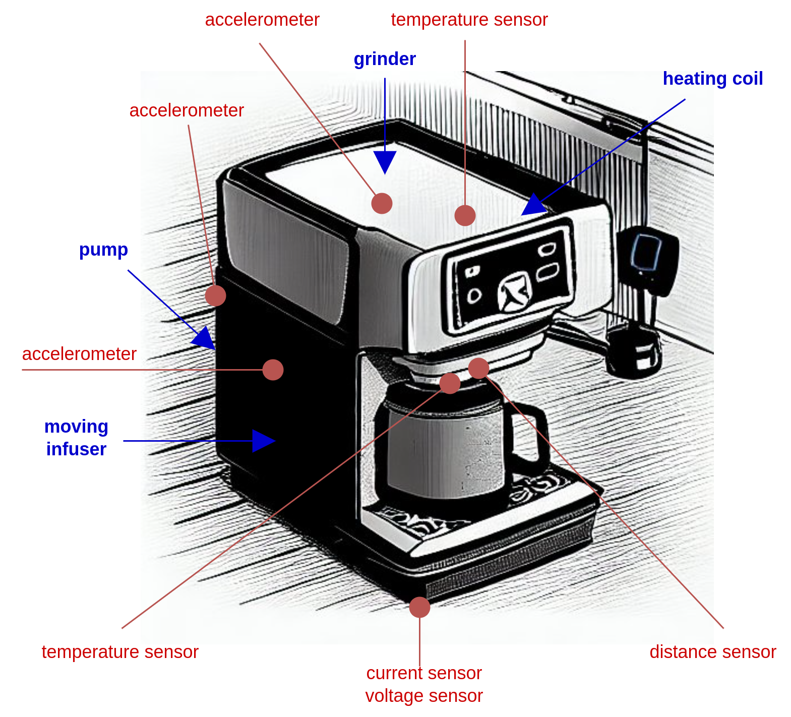
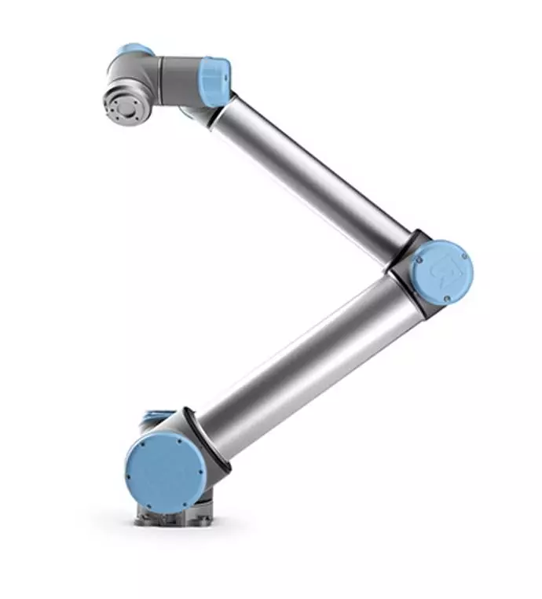
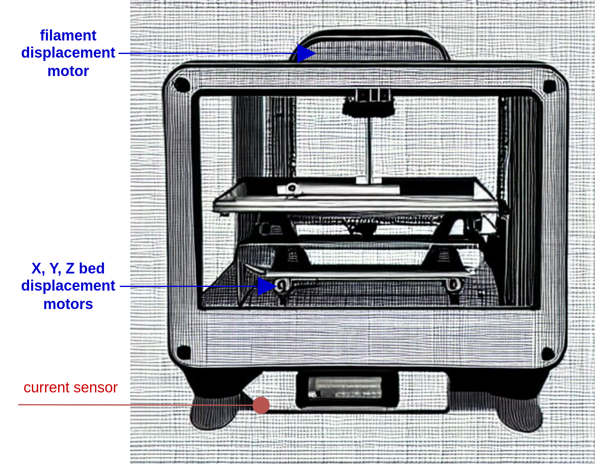
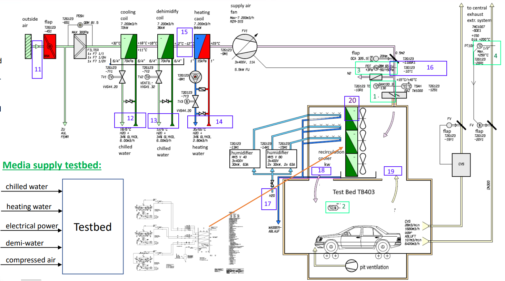
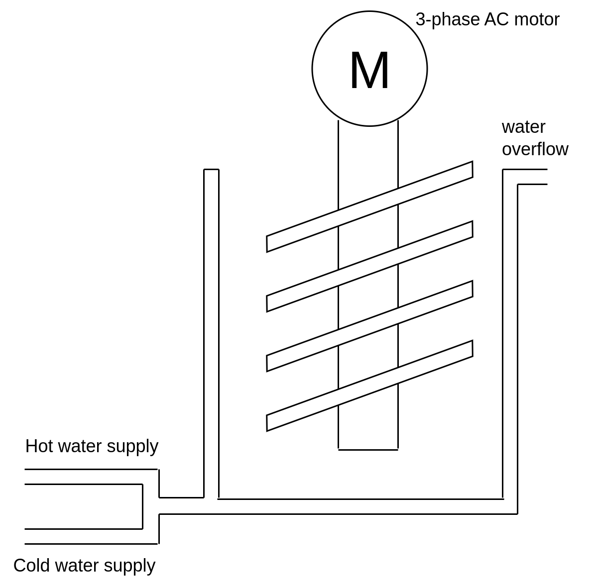
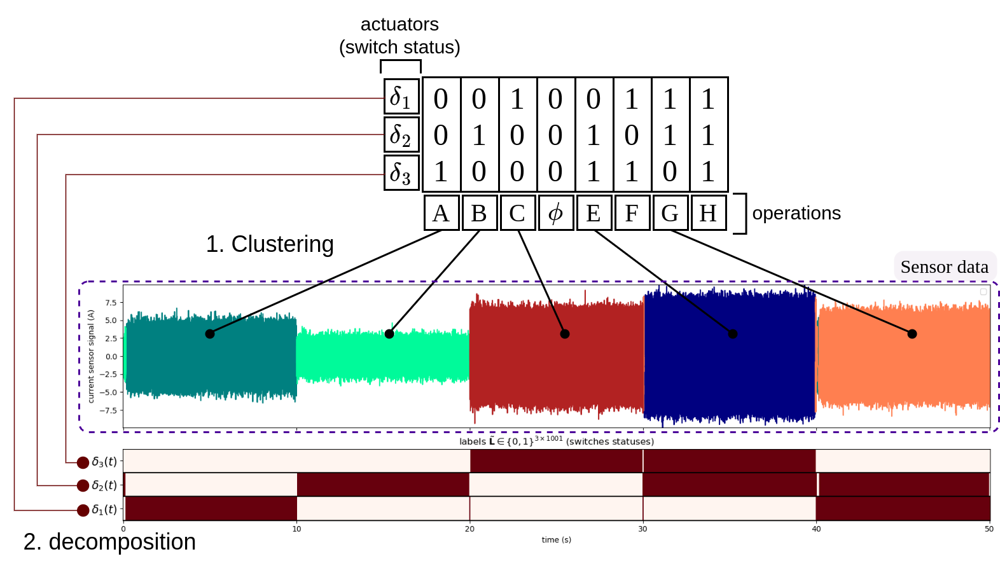
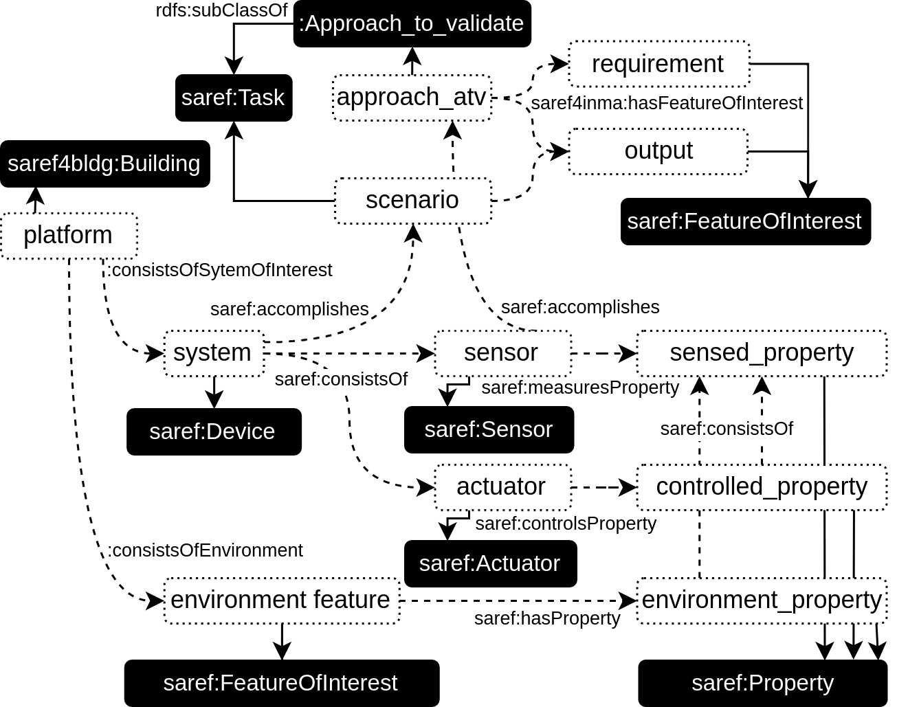
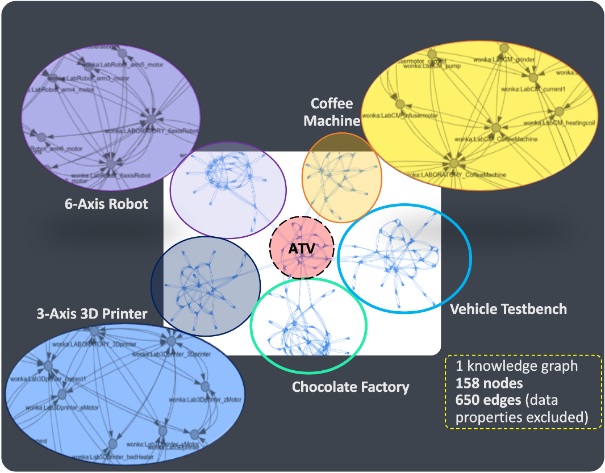

# WONKA Case Study

## Description

The WONKA case study comprehends five systems in their respective environments, for which a scientific approach is designed to fulfill dedicated specifications. The system "to design" is the scientific approach to be validated, hereinafter denoted **ATV**. More specifically, the use cases consist of Cyber-Physical Production Systems (CPPS) repeatedly manufacturing different kinds of units (coffees, targeted temperatures, etc.), whereas the ATV consists in an algorithm retrieving the activation sequences of the actuators composing these CPPS from sensor data. This decomposition is called *Multi-Label Clustering*, a special case of the *Underdetermined Blind Source Separation* inverse problem. 
Ultimately, this technique serves as a preliminary step to model individual dynamics and couplings within a mechatronic system, to locate the most energy intensive actuators, optimise their usage and design an interpretable digital twin.

**GOAL**: verify and validate a scientific approach on two industrial systems, given three laboratory systems. The solution shall enable systems engineer to correct, complete and verify specifications as early as possible (before/after experiments on laboratory systems, before/after experiments on industrial systems), taking into account the limited availability and cost of experiments on industrial systems.

The use cases, scientific approach and ontology making up this case study are presented below. The ontology provides a framework to formally represent the constitutive elements of this case study.

---
#### <u> Use cases </u>

##### Three *laboratory systems*:

1. <u>Coffee Machine</u>

The Coffee Machine use case consists of 1 automatic coffee machine (1 heating coil, 1 grinder, 1 pump and 1 moving infuser) and 8 sensors (3 accelerometers, 2 temperature sensors, 1 laser distance sensor, 1 current sensor, 1 voltage sensor).

<figure class="image">
  
  <figcaption><b>Figure 1: Laboratory instrumented coffee machine.</b></figcaption>
</figure>

Details about the formal representation of this use case can be found [here](ontology/instantiated/lab1_CoffeeMachine.html) (knowledge graph).

2. <u>Robot Arm</u>

The 6-axis robot arm repeatedly performs a specific motion (e.g., piece-picking). It consists of 6 (electrical) brushless motors to put each axis in motion, and it is equipped with 1 accelerometer to sense the motors' vibrations.

<figure class="image">
  
  <figcaption><b>Figure 2: Laboratory instrumented 6-axis robot arm.</b></figcaption>
</figure>

Details about the formal representation of this use case can be found [here](ontology/instantiated/lab2_RobotArm.html) (knowledge graph).

1. <u>3D Printer</u>

A laboratory Cartesian Fused Deposition Modelling (FDM) 3D printer is considered. The printer repeatedly manufactures a specific part. It consists of 4 (electrical) stepper motors moving the extruder along 3 directions and pushing the filament forward to be fused, together with 2 heating resistors (one for the bed, one on the extruder). The 3D printer is equipped with a single current sensor.

<figure class="image">
  
  <figcaption><b>Figure 3: Laboratory instrumented  cartesian fused deposition modelling (FDM) 3D printer.</b></figcaption>
</figure>

Details about the formal representation of this use case can be found [here](ontology/instantiated/lab3_3Dprinter.html) (knowledge graph).

##### Two *industrial systems* (from the [EnerMan Project](https://enerman-h2020.eu/)):

4. <u>Temperature-Controlled Vehicle Testbed</u>

The temperature- and humidity-controlled vehicle testbed is composed of 2 independent heating, ventilation and air conditioning (HVAC) systems. Overall, there are 2 cooling coils, 1 heating coils, 1 fan, 1 humidifier and 1 dehumidifier. The room is instrumented with 2 temperature sensors (1 after the first HVAC, 1 in the chamber).
In this use case, the only objective is to decompose the temperature signals.

<figure class="image">
  
  <figcaption><b>Figure 4: Temperature- and humidity-controlled chamber of a vehicle testbed.</b></figcaption>
</figure>

More information regarding this use case can be found in EnerMan's public deliverable on the [EnerMan Edge Flexible, Adaptable, Control Loop Support](https://enerman-h2020.eu/wp-content/uploads/2022/12/Attachment_0-7.pdf).
Details about the formal representation of this use case can be found [here](ontology/instantiated/ind1_VehicleTestbed.html) (knowledge graph).

5. <u>Mixing and Conching Machine in a Chocolate Factory</u>

The mixing and conching machine is responsible for stirring and heating up chocolate within a chocolate factory. The machine consists of 1 (electrical) three-phase alternative current motor and 1 heating coil. The heating mechanism is assumed to be electrically powered. The machine is instrumented with 3 current sensors (one on each phase of the current supply).

<figure class="image">
  
  <figcaption><b>Figure 5: Mixing and conching machine heating up and stirring chocolate.</b></figcaption>
</figure>

Details about the formal representation of this use case can be found [here](ontology/instantiated/ind2_ChocolateFactory.html) (knowledge graph).

---
#### <u> Scientific approach (ATV)</u>

The scientific approach considered here aims to solve a *Blind Source Separation* problem. That is, one seeks the activation sequence of each actuator within a mechatronic system in an unsupervised fashion, i.e., exclusively from sensor data. The proposed approach is illustrated in the figure below:

<figure class="image">
  
  <figcaption><b>Figure 6: Illustration of the activation sequence synthesis problem.</b></figcaption>
</figure>

There exist several approaches to tackle this problem. *Subspace* methods aim to retrieve mixed signals, i.e., a data matrix $`Y`$ is decomposed into a mixing matrix $`A`$ and the signals over time $`S`$ such that $`Y \approx A S`$. In the figure above, a sub-clustering approach is used (clustering centroids expressed as a composition of all other centroids). Mathematically, this translates as $`Y \approx C L`$, where data $`Y`$ is decomposed into centroids $`C`$ and multi-hot encoded binary labels $`L`$ (namely *activation sequences*).

Synthesising activation sequences proves useful when the manufacturing process is unknown or when it includes event-driven control. This information is seldom available to a factory pilot, yet it appears crucial to understand a system's performance (actuator usage, health and energy consumption for instance).

---
#### <u> Ontology </u>

In order to compare heterogeneous systems with one another, the [SAREF](https://saref.etsi.org/core/v3.1.1/) ontology (and [SAREF4INMA](https://saref.etsi.org/saref4inma/v1.1.2/) module) has been refined into the [wonka](ontology/raw/wonka.owl) ontology. This ontology can be visualised using [WebVOWL](https://service.tib.eu/webvowl/) (simply import the `.owl` file). 

The use cases have been formally represented in this ontology using the following implementation blueprint:

<figure class="image">
  
  <figcaption><b>Figure 7: Implementation blueprint of the knowledge base.</b></figcaption>
</figure>

Once instantiated, the ontology can be visualised as a knowledge graph:

<figure class="image">
  
  <figcaption><b>Figure 8: Knowledge graph for the WONKA dataset.</b></figcaption>
</figure>

See the [complete knowledge graph](ontology/instantiated/complete_knowledge_graph.html) of the WONKA case study for more details.

## Initial requirements

#### <u> Requirements </u>

The requirements can be categorised as *dynamic* if its compliance requires an experiment on a system, or *static* otherwise. The initial requirements are as follows:

| Requirement | Desrcription / Related question for query |
|---|---|
| Req 2.1 (dynamic) | Does the ATV accurately estimate the sequence of operating modes, given a performance threshold? |
| Req 2.2 (dynamic) | Does the ATV accurately identify the actuators activated in each operating mode? |
| Req 4.3 (static) | What are the elements of the environment that may tamper with the results of the ATV? |

<!-- 
| Req 2.7 (static) | For each actuator within a system of interest, is there at least one sensor monitoring an observable property this actuator affects? |

| Req 2.9 (static) | In a sensor energy domain, are the actuator-originated signals  coupled with one another? (i.e., actuators in series association) |

| Req 3.15 (static) | Does each sensor have a sampling rate  at least twice the maximum frequency of  the signals the actuators it monitors can produce? | 
-->

The requirements formally expressed as SPARQL queries can be found [here](requirements_as_sparql_queries/).
